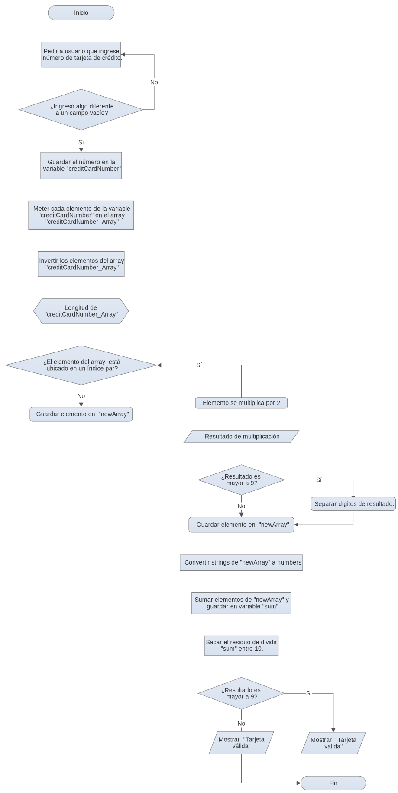

## Proyecto tarjeta de credito valida

1. Pedir a usuario que ingrese número de tarjeta de crédito.
2. Verificar que el usuario no ingrese un campo vacio
3. Seguir pidiendo a usuario que ingrese un numero si el campo esta vacio.
4. Guardar el numero en la variable "creditCardNumber"
5. Declarar un array vacio llamado "creditCardNumber_All"
6. Meter cada elemento de la variable "creditCardNumber" en el array "creditCardNumber_Array"
7. Invertir los elementos del array "creditCardNumber_Array" con el metodo reverse()
8. Declarar array vacio "newArray"
9. Crear un FOR con un IF dentro, en el cual los numeros que esten ubicados en un indice par se multipliquen por 2 y los numeros en un indice impar se mantengan igual. 
10. Declarar un array vacío llamado  "newArray".
11.	Poner un IF dentro del IF (indice par), en caso de que resultado sea mayor a 9, separar digitos y guardar en array "newArray"
12. Guardar nuevos digitos en"newArray"
13. Declarar variable "sum"
14. Convertir strings de "newArray" a numbers
15. Sumar elementos de "newArray" con un FOR y guardar en variable "sum"
16. Al resultado de "sum", sacar el residuo de la división entre 10 y guardar en variable "residue"
17. Mostrar si es una tarjeta valida si su residuo es 0.
18. Mostrar que es una tarjeta inválida si su residuo no es 0.
19. Llamar a función. Probar con 3625102593804.

